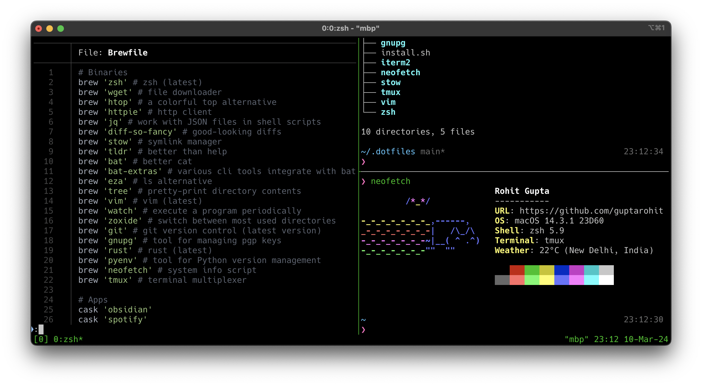

# Rohit’s dotfiles

These configuration files _aka_ dotfiles, and utilities are from my primary setup I use day-to-day, the core of which includes: macOS, [iTerm2](https://iterm2.com/), and the zsh shell. Symlinks for dotfiles are managed with the [Stow](https://www.gnu.org/software/stow/).

Feel free to try out these or use them as inspiration! If you have a suggestion, improvement or question, please feel free to open an issue or PR! :octocat:




## Installation
To set up, assuming `git` is installed, run:

```bash
git clone https://github.com/guptarohit/dotfiles.git ~/.dotfiles
cd $HOME/.dotfiles
bash install.sh
```

## Usage
To create symlinks, use [stow](https://brandon.invergo.net/news/2012-05-26-using-gnu-stow-to-manage-your-dotfiles.html). The following command will create symlinks for gnupg configs.
```bash
stow gnupg
```

Please note, if files are already present in the directory we are trying to create a stow in, then use the `--adopt` flag.
e.g.
```bash
stow gnupg --adopt
```


## Local configs

### zsh
System specific shell configurations can be added to `~/.zshrc.local`. It will be sourced when the shell initializes.

### Git
System specific git configurations like user's name, email, signing key, etc. can be added to `~/.gitconfig.local`.


## Acknowledgements

Inspired by various resources shared by the vibrant open-source community, including online resources and dotfiles repositories:

- [GitHub ❤ ~/](http://dotfiles.github.io/)
- [Using stow for dotfiles (video)](https://www.youtube.com/watch?v=y6XCebnB9gs)
- [Mathias's dotfiles](https://github.com/mathiasbynens/dotfiles)
- [Artem's dotfiles](https://github.com/sapegin/dotfiles)
- [Nico's dotfiles](https://github.com/snics/dotfiles)
- [Jonas's dotfiles](https://github.com/JDevlieghere/dotfiles)
- [Alan's dotfiles](https://github.com/apinstein/dotfiles)
