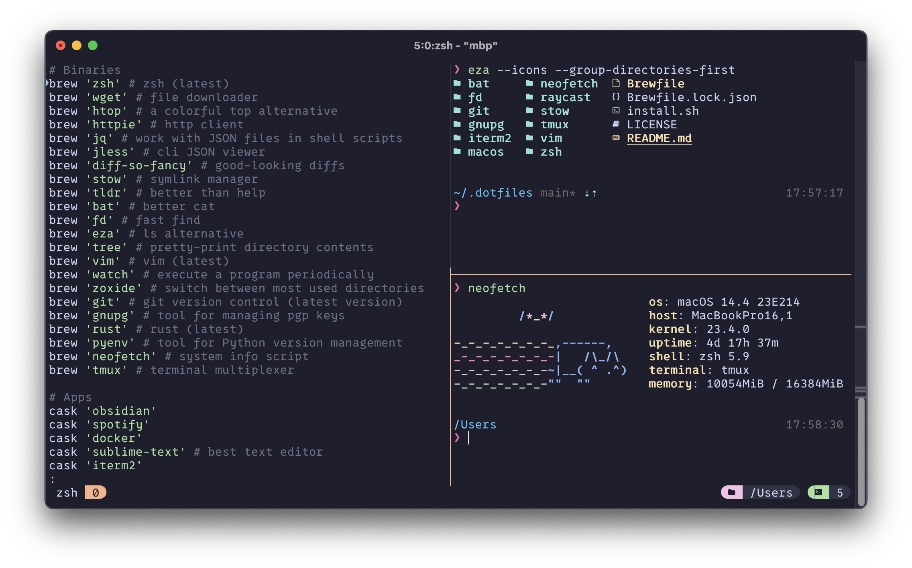

# Rohit's dotfiles

These configuration files _aka_ dotfiles, and utilities are from my primary setup I use day-to-day, the core of which includes: macOS, [iTerm2](https://iterm2.com/), and the zsh shell. Symlinks for dotfiles are managed with the [Stow](https://www.gnu.org/software/stow/).




## Highlights
- Flexible, terminal-based dev environment with iTerm2+Tmux
- Shell support for Zsh
- Fast, idempotent setup with GNU Stow
- Support for both Apple Silicon and Intel Macs
- Vim with plugins and theme support


## Installation
To set up, assuming `git` is installed, run:

```bash
git clone https://github.com/guptarohit/dotfiles.git ~/.dotfiles
cd $HOME/.dotfiles
bash install.sh
```
`install.sh` is an idempotent script that will:
- Install Homebrew and packages from the `Brewfile`
- Set up Oh My Zsh with plugins
- Configure vim with plugins
- Apply all dotfiles using GNU Stow
- Set up iTerm2 preferences

> [!NOTE]
> Please backup configurations before running script.

### macOS System Preferences
For macOS-specific system preferences and customizations, a separate script is present.

This script customizes various macOS settings for an improved experience. Review the script before running to understand the changes it will make.

```bash
bash ~/.dotfiles/macos/defaults.sh
```

### Vim setup
The vim configuration uses [vim-plug](https://github.com/junegunn/vim-plug) as a plugin manager. Plugins will be installed automatically during the setup process.
To install or update plugins manually, open vim and run `:PlugInstall`.

### Tmux plugins
To install plugins, including the [Catppuccin](https://github.com/catppuccin/tmux) theme, run the command prefix + I.


## Usage
To create symlinks, use [stow](https://brandon.invergo.net/news/2012-05-26-using-gnu-stow-to-manage-your-dotfiles.html). The following command will create symlinks for gnupg configs.
```bash
stow gnupg
```

Please note, if files are already present in the directory we are trying to create a stow in, then use the `--adopt` flag.
e.g.
```bash
stow gnupg --adopt
```


## Local configs

### zsh
System specific shell configurations can be added to `~/.zshrc.local`. It will be sourced when the shell initializes.

### Git
System specific git configurations like user's name, email, signing key, etc. can be added to `~/.gitconfig.local`.

### Vim
System specific vim configurations can be added to `~/.vimrc.local`. It will be sourced at the end of the main .vimrc file.


## Acknowledgements

Inspired by various resources shared by the vibrant open-source community, including online resources and dotfiles repositories:

- [GitHub ❤ ~/](http://dotfiles.github.io/)
- [Using stow for dotfiles (video)](https://www.youtube.com/watch?v=y6XCebnB9gs)
- [Mathias's dotfiles](https://github.com/mathiasbynens/dotfiles)
- [Artem's dotfiles](https://github.com/sapegin/dotfiles)
- [Nico's dotfiles](https://github.com/snics/dotfiles)
- [Jonas's dotfiles](https://github.com/JDevlieghere/dotfiles)
- [Alan's dotfiles](https://github.com/apinstein/dotfiles)
